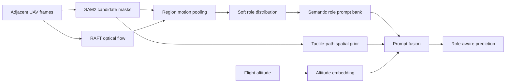
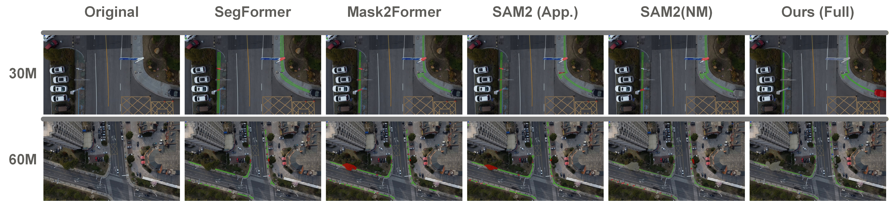
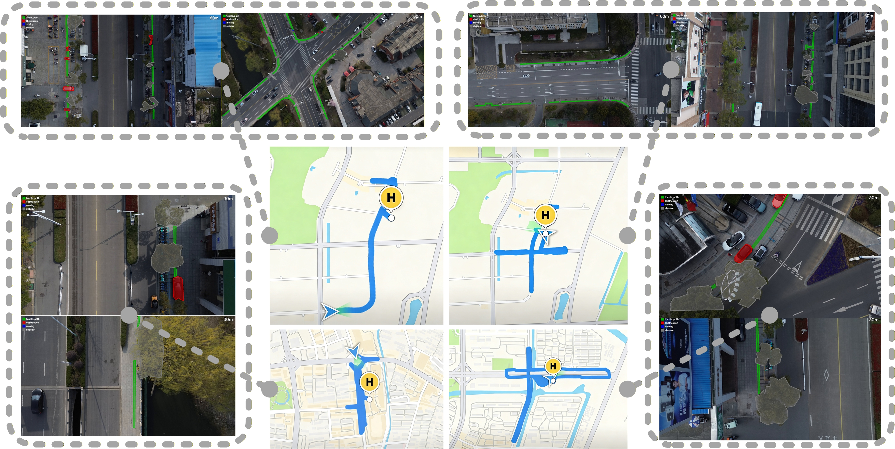
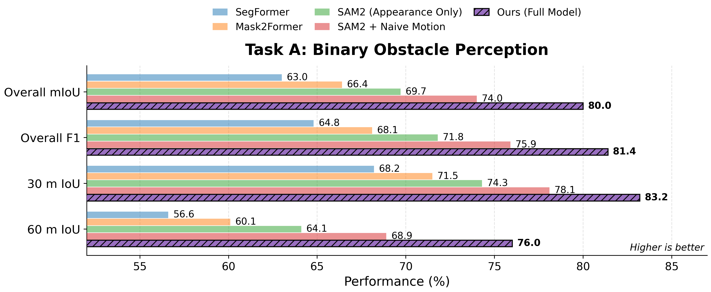
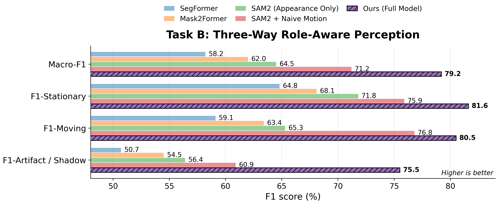
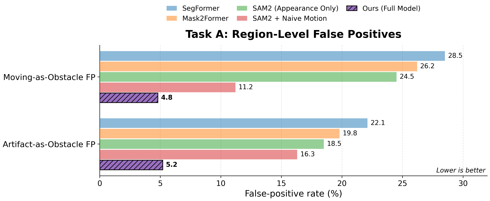

<div align="center">

# Role-Aware Tactile Path Perception from UAV Videos

### Motion-Semantic Guidance for Traversability-Aware Segmentation

[](#citation)
[](https://www.python.org/)
[](https://pytorch.org/)
[](https://huggingface.co/datasets/prettyyefan/UTP-9K)
[](https://github.com/prettyyefan/UTP-9K)
[](https://github.com/prettyyefan/UTP-9K/actions/workflows/ci.yml)

**Yefan Wang** · **Yusen Wu** · **Lingling Qu**

University of Shanghai for Science and Technology · Fujian University of Technology · Yangzhou University

</div>

<p align="center">
  
</p>

> **Core idea:** visually similar regions can play different roles for accessibility. The model therefore reasons about what an occupied tactile-path region **does to traversability**, rather than only what it looks like.

## Overview

Tactile paving observed from UAV videos may be occupied by persistent objects, temporarily crossed by pedestrians, or visually disturbed by shadows and artifacts. Appearance-only prediction can confuse these cases and generate false accessibility alarms.

This repository implements the paper-specific motion-semantic modules:

1. **SAM2 candidate localization** on or near the tactile-path ROI.
2. **RAFT optical flow** between adjacent UAV frames.
3. **Region-level motion evidence** using mean flow magnitude, magnitude variance, and directional entropy.
4. **Soft role reasoning** over stationary blockage, moving target, and artifact/shadow.
5. **Semantic prompt fusion** with tactile-path spatial and flight-altitude cues.



## Demonstration

<p align="center">
  <a href="./Figs/Demonstration.mov">
    
  </a>
</p>

<p align="center"><b>▶ Click the qualitative preview to open <code>Figs/Demonstration.mov</code>.</b></p>

For an animated README preview and a browser-compatible H.264 copy:

```bash
python tools/make_readme_assets.py --video Figs/Demonstration.mov
```

After generating `Figs/Demonstration_preview.gif`, replace the image source above with:

```html

```

## UTP-9K Benchmark

UTP-9K contains approximately **9,000 UAV frames** from **300 video clips**, captured at **30 m and 60 m** in urban streets and mall-adjacent public areas under sunny and cloudy conditions. The benchmark preserves stationary blockage, moving targets, shadow/artifact interference, weak paving patterns, and occlusion. Splits are video- and scene-disjoint to prevent adjacent-frame leakage.

| Property | UTP-9K |
|---|---:|
| UAV frames | ~9,000 |
| Video clips | 300 |
| Flight heights | 30 m / 60 m |
| Semantic roles | Stationary / Moving / Artifact-Shadow |
| Task A | Binary obstacle perception |
| Task B | Three-way role-aware perception |

<p align="center">
  
</p>

## Method

For candidate mask $s_i$, dense optical flow is pooled into

$$
\mathbf m_i = [\bar a_i,\;v_i,\;H_i^{\mathrm{dir}}]^\top,
$$

where $\bar a_i$ and $v_i$ are the mean and variance of flow magnitude, and $H_i^{\mathrm{dir}}$ is directional entropy. A lightweight MLP maps this descriptor to a soft role distribution

$$
\mathbf r_i = \operatorname{softmax}(\operatorname{MLP}(\mathbf m_i)).
$$

The role distribution softly aggregates a learnable semantic role bank and is fused with motion, tactile-path spatial, and altitude cues. The resulting token can be injected into the SAM2 prompt pathway for traversability-aware decoding.

<p align="center">
  
</p>

## Quantitative Results

### Task A — Binary obstacle perception

| Method | Overall mIoU ↑ | Overall F1 ↑ | 30 m IoU ↑ | 60 m IoU ↑ | Move FP ↓ | Art FP ↓ |
|---|---:|---:|---:|---:|---:|---:|
| SegFormer | 63.0 | 64.8 | 68.2 | 56.6 | 28.5 | 22.1 |
| Mask2Former | 66.4 | 68.1 | 71.5 | 60.1 | 26.2 | 19.8 |
| SAM2 (Appearance Only) | 69.7 | 71.8 | 74.3 | 64.1 | 24.5 | 18.5 |
| SAM2 + Naive Motion | 74.0 | 75.9 | 78.1 | 68.9 | 11.2 | 16.3 |
| **Ours (Full Model)** | **80.0** | **81.4** | **83.2** | **76.0** | **4.8** | **5.2** |

### Task B — Three-way role-aware perception

| Method | Macro-F1 ↑ | Stationary F1 ↑ | Moving F1 ↑ | Artifact/Shadow F1 ↑ |
|---|---:|---:|---:|---:|
| SegFormer | 58.2 | 64.8 | 59.1 | 50.7 |
| Mask2Former | 62.0 | 68.1 | 63.4 | 54.5 |
| SAM2 (Appearance Only) | 64.5 | 71.8 | 65.3 | 56.4 |
| SAM2 + Naive Motion | 71.2 | 75.9 | 76.8 | 60.9 |
| **Ours (Full Model)** | **79.2** | **81.6** | **80.5** | **75.5** |

<table>
<tr>
<td width="50%" align="center"><br><b>Task A performance</b></td>
<td width="50%" align="center"><br><b>Task B role discrimination</b></td>
</tr>
<tr>
<td colspan="2" align="center"><br><b>Region-level role-confusion false positives</b></td>
</tr>
</table>

## Qualitative Comparison

<p align="center">
  
</p>

## Installation

The paper uses frozen SAM2 and RAFT backbones with trainable motion/prompt modules. Install PyTorch and torchvision for the CUDA version on your machine, then install this package:

```bash
git clone https://github.com/prettyyefan/UTP-9K.git
cd UTP-9K

conda create -n utp9k python=3.10 -y
conda activate utp9k

# Install PyTorch/torchvision from https://pytorch.org/get-started/locally/
pip install -r requirements.txt
pip install -e .
```

Install the official SAM2 implementation separately:

```bash
git clone https://github.com/facebookresearch/sam2.git external/sam2
cd external/sam2
pip install -e ".[notebooks]"
cd ../..
```

Download a SAM2.1 checkpoint according to the official SAM2 instructions. Torchvision RAFT weights are downloaded automatically on first use.

## Quick Verification

The smoke test exercises the paper-specific motion descriptor, soft role model, spatial/altitude encoders, prompt fusion, and Task A/Task B heads without requiring external checkpoints:

```bash
python scripts/smoke_test.py
pytest -q
```

## Data Interface

The code uses a JSONL manifest so it can work with the public Hugging Face release without imposing a private local folder layout. See [`docs/DATA_FORMAT.md`](./docs/DATA_FORMAT.md).

Example:

```json
{
  "flow": "precomputed/flow/clip_001_000123.npy",
  "masks": "precomputed/masks/clip_001_000123.npz",
  "roles": ["stationary", "moving", "artifact"],
  "tactile_roi": "annotations/roi/clip_001_000123.npy",
  "altitude_m": 30,
  "appearance_features": "precomputed/features/clip_001_000123.npy"
}
```


## Precomputation

The trainable head consumes frozen-backbone outputs. Precompute RAFT flow and tactile-ROI-filtered SAM2 candidates with JSONL job manifests:

```bash
python scripts/precompute_flow.py \
  --manifest data/manifests/flow_jobs.jsonl \
  --root data/UTP-9K

python scripts/precompute_candidates.py \
  --manifest data/manifests/candidate_jobs.jsonl \
  --root data/UTP-9K \
  --sam2-config configs/sam2.1/sam2.1_hiera_l.yaml \
  --sam2-checkpoint checkpoints/sam2.1_hiera_large.pt
```

## Training

The reference trainer optimizes the motion MLP, semantic role prompt bank, spatial/altitude encoders, and lightweight fusion/head while keeping mask and flow extraction external:

```bash
python scripts/train_role_head.py \
  --manifest data/manifests/train.jsonl \
  --root data/UTP-9K \
  --epochs 40 \
  --batch-size 16 \
  --lr 1e-4 \
  --weight-decay 1e-4 \
  --output outputs/role_head.pt
```

## Video Inference

```bash
python scripts/infer_video.py \
  --video data/demo/input.mov \
  --roi-mask data/demo/tactile_roi.png \
  --checkpoint outputs/role_head.pt \
  --sam2-config configs/sam2.1/sam2.1_hiera_l.yaml \
  --sam2-checkpoint checkpoints/sam2.1_hiera_large.pt \
  --altitude 30 \
  --output outputs/demonstration.mp4
```

## Evaluation

Save region-level predictions as a Torch dictionary with `target_role` and `predicted_role`, then run:

```bash
python scripts/evaluate.py \
  --predictions outputs/predictions.pt \
  --output outputs/metrics.json
```

The evaluator reports Macro-F1, class-wise F1, Moving-as-Obstacle FP, and Artifact-as-Obstacle FP.

## Repository Structure

```text
UTP-9K/
├── Figs/                       # README images and Demonstration.mov
├── configs/default.yaml
├── docs/DATA_FORMAT.md
├── examples/
├── scripts/
│   ├── precompute_flow.py
│   ├── precompute_candidates.py
│   ├── train_role_head.py
│   ├── infer_video.py
│   ├── evaluate.py
│   └── smoke_test.py
├── src/utp9k/
│   ├── adapters/               # Frozen SAM2 and RAFT interfaces
│   ├── data/
│   ├── metrics/
│   ├── models/                 # Motion descriptor and role prompts
│   ├── visualization/
│   └── pipeline.py
├── tests/
├── tools/
│   ├── make_readme_assets.py
│   ├── check_readme_assets.py
│   └── plot_results.py
├── CITATION.cff
├── pyproject.toml
└── README.md
```

## Reproducing the README Visualizations

```bash
python tools/plot_results.py
python tools/check_readme_assets.py
```

Copy or move the generated plots into `Figs/` if the plotting script is run elsewhere.

## Citation

```bibtex
@inproceedings{wang2026roleaware,
  title     = {Role-Aware Tactile Path Perception from UAV Videos via Motion-Semantic Guidance},
  author    = {Wang, Yefan and Wu, Yusen and Qu, Lingling},
  booktitle = {International Conference on Artificial Neural Networks (ICANN)},
  year      = {2026}
}
```

Publication pages and DOI will be added after the proceedings are released.

## Acknowledgements

This project builds on [SAM2](https://github.com/facebookresearch/sam2) and the RAFT implementation distributed with [torchvision](https://pytorch.org/vision/stable/models/optical_flow.html). Their source code, checkpoints, and licenses remain with their respective authors. This repository does not redistribute third-party model weights.

## Contact

For questions about the paper, code, or dataset, open a GitHub issue or contact the corresponding author through the information provided in the paper.
